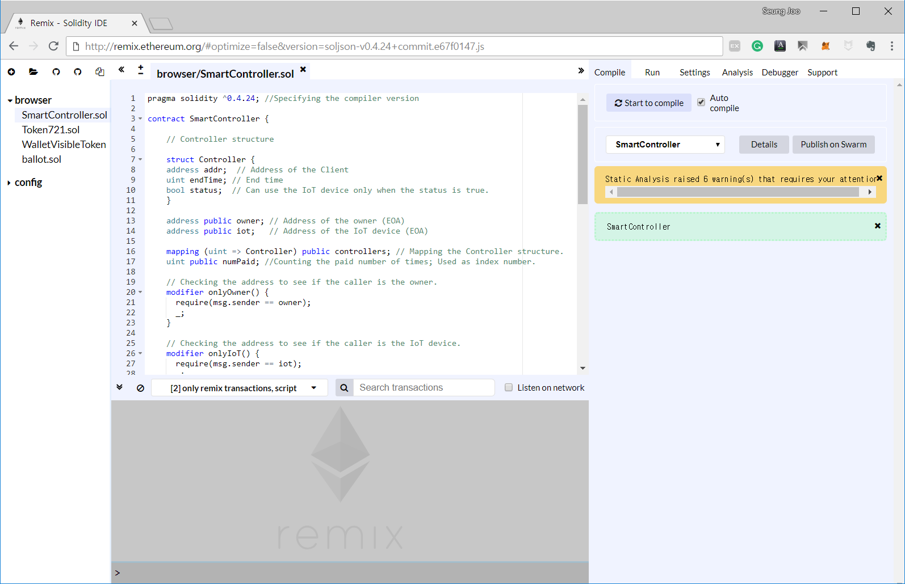

# Chapter 2
### Distributing smart contract

---

Now we will distribute the code as a smart contract.

Since creating the source code has done, we need to compile it.

We will use Remix to compile the code.
Remix is a browser solidity IDE.
Through Remix we can distribute the smart contract and also it provides various tools for development.

We could use other tools like Mist which provides ways to distribute the contract and acts as an Ethereum wallet. However, to use the Mist, we need to go through some complicated method that uses command line interface that has to be linked with geth and such.

So in this article, we will use Remix to distribute and compile the code which is a bit more simple way.

If you first visit the [Remix](https://remix.ethereum.org/), you might see some pre written example code about voting.

We will erase this first.
Then, we will copy and paste the codes from chapter 1.
>If you want to keep the example source code, you can click + icon on top left of the screen and create a new solidity file.

>**Note:** If you get a pop-up warning about https, you need to change the https to http from the address line. Remix recommends to use http. If you didn't get any warnings, then you may proceed.

Now we will go to the Setting top on the top right corner and change the compiler version by using **select new compile version**.
For now, we will use  0.4.24+commit.e67f0147.

>Solidity is getting upgraded every month, thus it removes or adds some grammar.
Because of this, some of the old grammar might cause error. It is important to check the version of the compiler.

Let's go back to the first page by pressing the Compile tab. We'll compile the code by pressing the **Start to compile** button.

After a while, if the compiling is successfully completed, you'll see some yellow warning boxes as well as the green box about our SmartController contract.

Now the compile is completed, let's test some code.

In order to do this, we will press **Run** tab on the top right. Then we will choose Java Script VM from the Environment tab.

By using this environment, it gives 5 temporary account with 100 Ether each in it.
Now we have all the settings to test our contract.

You can see the information about each accounts through Account tab.
You can copy the address of the account by pressing the clip-board icon on the right.

Before we will deploy the contract by pressing the deploy button, let's take a look at our constructor code.

~~~Solidity
//Constructor; Take the address of the IoT device as a parameter.
constructor (address _iot) public { // Must put access modifier
  owner = msg.sender; // Put the adddress of the constructor of this contract
  iot = _iot;         // into owner variable.
  numPaid = 0;
}
~~~

As you can see, when the contract is constructed the address of the IoT device goes in as a parameter.
As we've seen from chapter 1, this contract has 3 subject.

1. The contract distributor - Owner
2. IoT device - iot
3. Client who rents the device - clients

We will consider each accounts, first, second and the third account, as a owner, an iot and a client.

Now we will choose the second account and copy it's address by clicking the clip-board icon.
and paste it next to red deploy box.

Then, we will choose the first account again, since it's the first account that deploys the contract.
Now we will press the deploy button as a first account.

If the contract was successfully distributed, it will have similar screen as above image.

We need to take a look at the two factor.

1. The Ether of the first account has reduced from 100 to 99.999...
2. Some of the function below is marked with red boxes while other is marked with blue.

Solidity has a price called **gas**. The gas is cost whenever a contract is distributed or a transaction was made that changes the status of the contract.

The gas has a maximum usage limit and is estimated for each executed commands. Through these regulations, it can prevent from using an infinite loop in a contract to paralyze the network.
Also the gas is paid to the miner who process the transactions for their service towards the network.

In this contract, the red functions mean it uses a gas to execute while blue functions don't which only reads some variables of the contract.

Now let's summarize some of the functions.

First, let's take a look at the red functions.
- kill: It kills the contract and can be called by **distributor**.
- payToController: In order to rent the IoT device **client** calls this function to pay an Ether.
- updateStatus: **The IoT device** calls this function to end the renting status of the clinet when their end time has reached.
- withdrawFunds: It is used to withdraw the Ethers that has been stored in the contract by the **owner**(in this case, the distributor).

Next, we have blue functions.
- controllers: It can check the information of the client who has rent the IoT device. Client is distincted from each other by index number.
- IoT: Returns the address of the IoT device that is linked with the contract.
- numPaid: Returns the number of client that have rent the IoT device. Also the number is used whenever a new client rents the device as a index number of controllers.
- owner: Returns the address of the owner.

Now let's run some of the blue functions first.
- Put value 0 into the controllers function and press the blue box. Since no one has rent the IoT device, it will return no address and no endTime. Also the status will be set in false as a default.
- If we press the IoT, it will return the address of the IoT device which is the address of our second account.
- If we press the numPaid, it will return 0 since nobody has rent the device.
- Pressing the owner will return the address of the owner which is the address of our first account.

Now let's pay some Ether to rent the device.

First, select third account from Account tab and set the value tab as **ether**. Then put value 1 in the value tab since we are goint to send 1 ether to the contract.
Let's press payToController.

You will see that the ether of the third account has reduced.
Now, let's put value 0 into the controllers function and click it. It will return the address of the third account, an endTime and the status which will be true this time.

If you'd like to try with other accounts, forth and fifth account, you may try the same process and check their status.

Since the client (the third account) have rent the IoT device, let's assume that the end time of the client has reached and we need to make the status of the client into false.

We can do this by using updateStatus function and IoT account since only the IoT device can call this function.

Let's change the Account tab into the second account, which we were using as an IoT device, and put value 0 into the updateStatus, which is an index number of the client number 0.

If the transaction was successfully processed, we can check the result by using controllers function and give it a value 0.

Then it will return the address and the end time of the first client and a status that has changed into fasle. You can see it returns different values unlike the first time we've called the controllers function which only returned an empty values.

Now, the rent of the IoT device has finished.

Lastly let's withdraw the ether that client have paid to the contract.

Let's select the first account, which is an owner account, and click withdrawFunds.

Then you will see the balance of the first account have increased.

 

This is all the interactions between the subjects of the contract.
On next chapter, we will test the whole process using Metamask and Ropsten test network.
